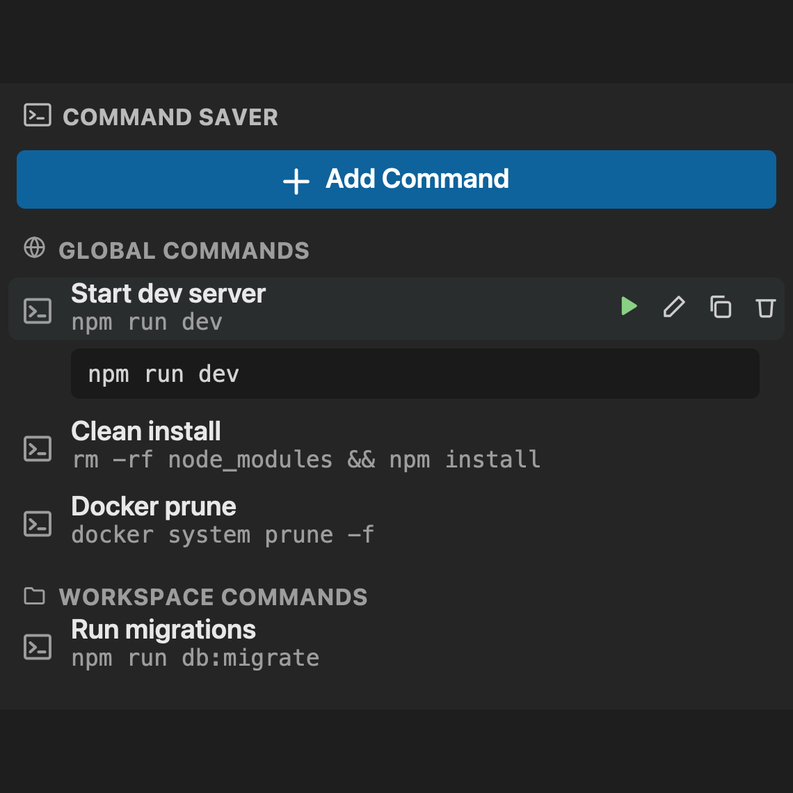

# Command Saver

Save the terminal commands and scripts you run all the time, and run them again with one click — right from a panel in the Activity Bar. No more digging through shell history.

## Features

- **One-click run** — every saved command runs in a dedicated integrated terminal, reused across runs.
- **Global or workspace-scoped** — save a command to *Global* to have it available in every project, or to *Workspace* to store it in `.vscode/comsaver.json` so it can be committed and shared with your team.
- **Multi-line scripts** — the command field is a full textarea, so saved entries aren't limited to one line.
- **Edit in place** — click a row to preview the full command, or use the inline actions to run, edit, copy, or delete it.

## Usage

1. Open the Command Saver icon in the Activity Bar.
2. Click **Add Command**, give it a label, and enter the command or script.
3. Choose *Global* or *Workspace* (workspace only appears when a folder is open).
4. Click a command's **Run** button to send it to the terminal.

## Requirements

None — no runtime dependencies, no configuration needed.
